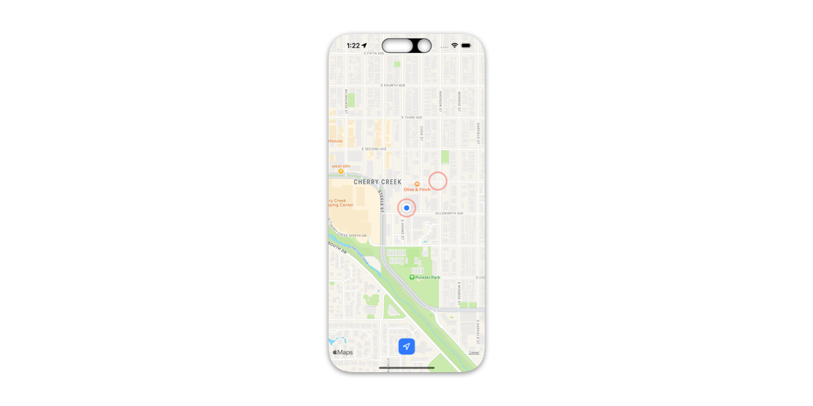

# GeoExperiment

A small geofencing experiment with iOS expanding on [GurjitGora/geofencing](https://github.com/GurjitGora/geofencing).

## Goal 

- Learn basic geofencing with MapKit.
- Invoke HTTP request to external API and local notification a when user enters or exits a geographic region.

